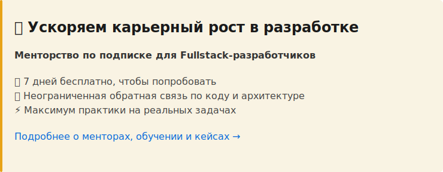

# 3.1.4 Базовые типы

TypeScript — это JavaScript с **системой типов**. Типы помогают отловить ошибки на этапе разработки, а не в production. В этом разделе разберём основные типы данных, которые ты будешь использовать каждый день.

---

## 🎯 Что ты узнаешь

- Примитивные типы: `string`, `number`, `boolean`
- Массивы и кортежи (tuples)
- Union типы для вариативных значений
- Literal типы для точных значений
- Специальные типы: `any`, `unknown`, `void`, `never`
- Type assertions (приведение типов)
- Когда использовать какой тип

---

## 📖 Примитивные типы

Начнём с базовых типов JavaScript.

### string — строки

```typescript
let city: string = "Москва";
const apiKey: string = "abc123";
let description: string;

description = "Солнечно"; // ✅ Работает
description = 123;         // ❌ Ошибка: Type 'number' is not assignable to type 'string'
```

**Когда использовать:**
- Текст, названия, описания
- API ключи, токены
- URL, пути к файлам

---

### number — числа

В TypeScript **нет отдельных типов** для целых и дробных чисел — все числа имеют тип `number`.

```typescript
let temperature: number = 20;
const humidity: number = 65.5;
let windSpeed: number;

windSpeed = 15;      // ✅ Целое число
windSpeed = 15.7;    // ✅ Дробное число
windSpeed = "15";    // ❌ Ошибка: Type 'string' is not assignable to type 'number'
```

**Специальные числовые значения:**
```typescript
let result: number;

result = 42;         // ✅ Обычное число
result = Infinity;   // ✅ Бесконечность
result = -Infinity;  // ✅ Минус бесконечность
result = NaN;        // ✅ Not a Number
```

---

### boolean — логические значения

```typescript
let isLoading: boolean = false;
const isOnline: boolean = true;
let hasError: boolean;

hasError = false;       // ✅ Работает
hasError = 0;           // ❌ Ошибка: Type 'number' is not assignable to type 'boolean'
hasError = "";          // ❌ Ошибка: Type 'string' is not assignable to type 'boolean'
```

> 💡 **Важно:** В TypeScript нельзя использовать "truthy/falsy" значения вместо boolean (как в JavaScript). Только `true` или `false`.

---

## 📦 Массивы

Два способа объявить тип массива:

### Способ 1: Type[]

```typescript
let cities: string[] = ["Москва", "Санкт-Петербург", "Казань"];
let temperatures: number[] = [20, 18, 22, 15];
let flags: boolean[] = [true, false, true];
```

### Способ 2: Array<Type>

```typescript
let cities: Array<string> = ["Москва", "Санкт-Петербург"];
let temperatures: Array<number> = [20, 18, 22];
```

> 💡 **Совет:** Используй `Type[]` — это короче и читабельнее. `Array<Type>` используется для сложных generic-типов.

---

### Работа с массивами

```typescript
let cities: string[] = ["Москва"];

// Методы массива работают с учётом типов
cities.push("Казань");         // ✅ Работает
cities.push(123);              // ❌ Ошибка: Argument of type 'number' is not assignable

// TypeScript знает типы при итерации
cities.forEach((city) => {
  console.log(city.toUpperCase()); // ✅ city — это string, есть автодополнение
});

// Методы массивов тоже типизированы
const firstCity: string = cities[0];
const cityCount: number = cities.length;
```

---

### Многомерные массивы

```typescript
// Массив массивов чисел
let matrix: number[][] = [
  [1, 2, 3],
  [4, 5, 6],
  [7, 8, 9]
];

// Массив массивов строк
let schedule: string[][] = [
  ["Понедельник", "Солнечно"],
  ["Вторник", "Дождь"],
  ["Среда", "Облачно"]
];
```

---

## 🎲 Кортежи (Tuples)

Кортеж — это **массив фиксированной длины** с **известными типами** для каждой позиции.

```typescript
// Кортеж: [string, number]
let weatherData: [string, number];

weatherData = ["Москва", 20];        // ✅ Правильный порядок
weatherData = [20, "Москва"];        // ❌ Ошибка: неправильный порядок типов
weatherData = ["Москва", 20, true];  // ❌ Ошибка: лишний элемент
```

**Когда использовать кортежи:**
```typescript
// Координаты: [широта, долгота]
let coordinates: [number, number] = [55.7558, 37.6173];

// RGB цвет: [red, green, blue]
let color: [number, number, number] = [255, 128, 0];

// Пара ключ-значение
let setting: [string, boolean] = ["darkMode", true];
```

---

### Именованные кортежи

Можно добавить названия для лучшей читаемости:

```typescript
let coordinates: [lat: number, lon: number] = [55.7558, 37.6173];
let weatherData: [city: string, temp: number, humidity: number] = ["Москва", 20, 65];

// Названия не влияют на типизацию — это просто подсказки
const [lat, lon] = coordinates; // lat и lon — оба number
```

---

## 🔀 Union типы

Union тип позволяет значению быть **одним из нескольких типов**.

```typescript
// Температура может быть числом или null (если данные не загружены)
let temperature: number | null;

temperature = 20;      // ✅ Работает
temperature = null;    // ✅ Работает
temperature = "20";    // ❌ Ошибка: Type 'string' is not assignable

// ID может быть числом или строкой
let userId: number | string;

userId = 123;          // ✅ Работает
userId = "abc-123";    // ✅ Работает
userId = true;         // ❌ Ошибка: Type 'boolean' is not assignable
```

---

### Literal Union типы

Можно ограничить значение **конкретным набором** литералов:

```typescript
// Состояние загрузки — только эти 4 значения
let loadingState: "idle" | "loading" | "success" | "error";

loadingState = "idle";       // ✅ Работает
loadingState = "loading";    // ✅ Работает
loadingState = "pending";    // ❌ Ошибка: Type '"pending"' is not assignable

// Единицы измерения температуры
let unit: "celsius" | "fahrenheit";

unit = "celsius";      // ✅ Работает
unit = "kelvin";       // ❌ Ошибка: Type '"kelvin"' is not assignable
```

**Преимущества Literal Union:**
- ✅ Автодополнение в IDE
- ✅ Защита от опечаток
- ✅ Документирование допустимых значений

---

### Union с несколькими типами

```typescript
// Значение может быть числом, строкой или boolean
let value: number | string | boolean;

value = 42;           // ✅
value = "text";       // ✅
value = true;         // ✅
value = null;         // ❌ Ошибка

// Массив может содержать числа и строки
let mixedArray: (number | string)[];

mixedArray = [1, "два", 3, "four"];  // ✅ Работает
mixedArray = [1, 2, true];           // ❌ Ошибка: boolean недопустим
```

---

## 🎯 Literal типы

Literal тип — это **конкретное значение** как тип.

### Строковые литералы

```typescript
// Переменная может быть только "success"
let status: "success" = "success";

status = "success";  // ✅ Работает
status = "error";    // ❌ Ошибка: Type '"error"' is not assignable to type '"success"'

// Const автоматически получает literal тип
const apiUrl = "https://api.weather.com"; // Тип: "https://api.weather.com"
let apiUrl2 = "https://api.weather.com";  // Тип: string
```

---

### Числовые литералы

```typescript
// HTTP статус-коды
let statusCode: 200 | 404 | 500;

statusCode = 200;   // ✅ Работает
statusCode = 404;   // ✅ Работает
statusCode = 403;   // ❌ Ошибка: Type '403' is not assignable

// Размеры иконок
let iconSize: 16 | 24 | 32 | 48;

iconSize = 24;      // ✅ Работает
iconSize = 20;      // ❌ Ошибка: Type '20' is not assignable
```

---

### Boolean литералы

```typescript
// Всегда true
let isProduction: true = true;

isProduction = true;   // ✅ Работает
isProduction = false;  // ❌ Ошибка: Type 'false' is not assignable to type 'true'
```

Literal boolean типы полезны в union типах:

```typescript
type Theme = "light" | "dark" | "auto";
type AutoTheme = { mode: "auto"; followSystem: true };
type ManualTheme = { mode: "light" | "dark"; followSystem: false };

let theme: AutoTheme | ManualTheme;

theme = { mode: "auto", followSystem: true };   // ✅ Работает
theme = { mode: "light", followSystem: false }; // ✅ Работает
theme = { mode: "auto", followSystem: false };  // ❌ Ошибка
```

---

## 🌫️ Специальные типы

### any — отключает проверку типов

```typescript
let value: any;

value = 42;                // ✅ Любое значение
value = "text";            // ✅ Любое значение
value = true;              // ✅ Любое значение
value.nonExistentMethod(); // ✅ TypeScript не проверяет — ошибка будет в runtime!
```

**⚠️ Избегай `any`!** Он отключает все преимущества TypeScript.

**Когда `any` допустим:**
- Миграция с JavaScript на TypeScript (временно)
- Работа с внешними библиотеками без типов
- Прототипирование (но потом замени на правильный тип)

---

### unknown — безопасная альтернатива any

```typescript
let value: unknown;

value = 42;                // ✅ Можно присвоить любое значение
value = "text";            // ✅ Можно присвоить любое значение

// ❌ Но нельзя использовать без проверки типа
let str: string = value;   // ❌ Ошибка: Type 'unknown' is not assignable to type 'string'

// ✅ Нужно проверить тип перед использованием
if (typeof value === "string") {
  let str: string = value; // ✅ Работает — TypeScript знает что это string
}
```

**Используй `unknown` вместо `any`** — он заставляет проверить тип перед использованием.

---

### void — отсутствие возвращаемого значения

```typescript
// Функция ничего не возвращает
function logWeather(city: string): void {
  console.log(`Погода в городе ${city}`);
  // Нет return или return без значения
}

// Можно вернуть undefined явно
function doNothing(): void {
  return undefined; // ✅ Работает
}

// ❌ Нельзя вернуть значение
function incorrect(): void {
  return 42; // ❌ Ошибка: Type 'number' is not assignable to type 'void'
}
```

---

### never — значение, которое никогда не произойдёт

```typescript
// Функция, которая всегда выбрасывает ошибку
function throwError(message: string): never {
  throw new Error(message);
  // Сюда код никогда не дойдёт
}

// Бесконечный цикл
function infiniteLoop(): never {
  while (true) {
    // ...
  }
}

// never в union типах — исключение случая
type Status = "success" | "error";

function handleStatus(status: Status) {
  if (status === "success") {
    console.log("Успех");
  } else if (status === "error") {
    console.log("Ошибка");
  } else {
    // status имеет тип never — все случаи обработаны
    const exhaustiveCheck: never = status;
  }
}
```

---

## 🔄 Type Assertions (приведение типов)

Иногда **ты знаешь тип лучше**, чем TypeScript. Type assertion говорит компилятору: "доверься мне".

### Синтаксис as

```typescript
// TypeScript думает что это HTMLElement | null
const input = document.getElementById("cityInput");

// Мы знаем что это точно HTMLInputElement
const typedInput = input as HTMLInputElement;

// Теперь можем работать с .value
typedInput.value = "Москва"; // ✅ Работает
```

---

### Пример с API

```typescript
// Fetch возвращает any, но мы знаем структуру ответа
async function fetchWeather(city: string) {
  const response = await fetch(`/api/weather?city=${city}`);
  const data = await response.json(); // Тип: any

  // Говорим TypeScript что это WeatherData
  const weather = data as { city: string; temperature: number };

  return weather.temperature; // ✅ TypeScript знает что есть .temperature
}
```

---

### as const — неизменяемые литералы

```typescript
// Без as const
let cities = ["Москва", "Казань"];
// Тип: string[]

// С as const
let citiesConst = ["Москва", "Казань"] as const;
// Тип: readonly ["Москва", "Казань"]

citiesConst[0] = "Питер"; // ❌ Ошибка: Cannot assign to '0' because it is a read-only property
```

**Когда использовать `as const`:**
- Конфигурация, которая не должна меняться
- Массивы для union типов
- Объекты с фиксированными значениями

---

## 🔧 Практика 3.1.4.1: Песочница для экспериментов

Начнём с standalone практики для быстрых экспериментов с типами (не связан с погодным проектом).

### Шаг 0: Создай playground

Создай файл `playground.ts` в корне проекта со следующим кодом:

```typescript
// playground.ts
console.log("=== Тестирование типов ===\n");

// ЗАДАНИЕ 1: Примитивные типы
let userName = "Иван";
let userAge = 25;
let isActive = true;

// ЗАДАНИЕ 2: Массивы
let numbers = [1, 2, 3, 4, 5];
let colors = ["red", "green", "blue"];
let mixed = [1, "two", 3, "four"];

// ЗАДАНИЕ 3: Кортежи
let userInfo = ["Анна", 30];
let coordinates = [55.7558, 37.6173];
let response = [200, "OK", true];

// ЗАДАНИЕ 4: Union типы
let id = 123;
let status = "pending";
let data = null;

id = "abc-123";
status = "approved";
data = "some data";

// ЗАДАНИЕ 5: Literal типы
let direction = "north";
let httpStatus = 200;
let enabled = true;

// ЗАДАНИЕ 6: Функции
function greet(name) {
  return `Привет, ${name}!`;
}

function add(a, b) {
  return a + b;
}

function logMessage(message) {
  console.log(message);
}

function getRandomNumber(min, max) {
  return Math.floor(Math.random() * (max - min + 1)) + min;
}

// ЗАДАНИЕ 7: any vs unknown
let value1: any = "test";
let value2: any = 123;

// ЗАДАНИЕ 8: void и never
function showAlert(message) {
  alert(message);
}

function throwError(message) {
  throw new Error(message);
}
```

---

### Задания

**1. Добавь типы к примитивам:**
   - `userName` — строка
   - `userAge` — число
   - `isActive` — булево значение

**2. Типизируй массивы:**
   - `numbers` — массив чисел
   - `colors` — массив строк
   - `mixed` — массив, который может содержать числа И строки (используй union в скобках)

**3. Создай типы для кортежей:**
   - `userInfo` — кортеж из имени (строка) и возраста (число)
   - `coordinates` — кортеж из двух чисел
   - `response` — кортеж из числа, строки и булева значения

**4. Добавь union типы:**
   - `id` — может быть либо числом, либо строкой
   - `status` — может быть только одним из трёх значений: "pending", "approved" или "rejected"
   - `data` — может быть строкой или null

**5. Используй literal типы:**
   - `direction` — только 4 направления света: "north", "south", "east", "west"
   - `httpStatus` — только три кода: 200, 404, 500
   - `enabled` — всегда только true (не false!)

**6. Типизируй функции:**
   - `greet` — принимает строку (имя), возвращает строку (приветствие)
   - `add` — принимает два числа, возвращает число (сумму)
   - `logMessage` — принимает строку, ничего не возвращает
   - `getRandomNumber` — принимает два числа (min, max), возвращает число

**7. Замени `any` на `unknown`:**
   - Измени тип `value1` на `unknown`
   - Добавь проверку типа (typeof) перед использованием

**8. Используй специальные типы:**
   - `showAlert` — ничего не возвращает (какой тип для этого?)
   - `throwError` — никогда не завершается нормально (какой специальный тип используется?)

---

### Проверка

**Запусти проверку типов:**
```bash
npx tsc playground.ts --noEmit
```

**Попробуй сделать ошибки:**
```typescript
userName = 123;              // ❌ Должна быть ошибка
numbers.push("text");        // ❌ Должна быть ошибка
status = "cancelled";        // ❌ Должна быть ошибка (неправильное значение)
id = true;                   // ❌ Должна быть ошибка
```

Если TypeScript ловит эти ошибки — типы работают правильно! ✅

---

### 💡 Если застрял

<details>
<summary>💡 Подсказка: примитивы и массивы</summary>

```typescript
let userName: string = "Иван";
let userAge: number = 25;
let isActive: boolean = true;

let numbers: number[] = [1, 2, 3, 4, 5];
let colors: string[] = ["red", "green", "blue"];
let mixed: (number | string)[] = [1, "two", 3, "four"];
```
</details>

<details>
<summary>💡 Подсказка: кортежи и union типы</summary>

```typescript
let userInfo: [string, number] = ["Анна", 30];
let coordinates: [number, number] = [55.7558, 37.6173];
let response: [number, string, boolean] = [200, "OK", true];

let id: number | string = 123;
let status: "pending" | "approved" | "rejected" = "pending";
let data: string | null = null;
```
</details>

<details>
<summary>💡 Подсказка: функции и специальные типы</summary>

```typescript
function greet(name: string): string {
  return `Привет, ${name}!`;
}

function add(a: number, b: number): number {
  return a + b;
}

function logMessage(message: string): void {
  console.log(message);
}

function throwError(message: string): never {
  throw new Error(message);
}
```
</details>

<details>
<summary>💡 Подсказка: any vs unknown</summary>

```typescript
let value1: unknown = "test";

// Нужна проверка типа перед использованием
if (typeof value1 === "string") {
  console.log(value1.toUpperCase()); // ✅ Безопасно
}
```
</details>

---

### Эксперименты

После выполнения заданий попробуй:

1. **Создать свои типы:**
   ```typescript
   let priority: "low" | "medium" | "high" = "medium";
   let rgb: [number, number, number] = [255, 128, 0];
   ```

2. **Поиграться с type assertions:**
   ```typescript
   let someValue: unknown = "hello";
   let strLength = (someValue as string).length;
   ```

3. **Тестировать narrowing:**
   ```typescript
   function printId(id: number | string) {
     if (typeof id === "string") {
       console.log(id.toUpperCase());
     } else {
       console.log(id.toFixed(2));
     }
   }
   ```

**Запускай проверку после каждого изменения:**
```bash
npx tsc playground.ts --noEmit
```

> 💡 Этот файл — твоя песочница! Экспериментируй с типами, делай ошибки и смотри как TypeScript на них реагирует.

---

## 🔧 Практика 3.1.4.2: Типизация базовых переменных

Продолжаем развивать погодное приложение из практики 3.1.3. Добавим типизированные переменные для управления состоянием.

### Шаг 0: Дополни существующий код

Открой `src/app.ts` и добавь в начало файла:

```typescript
// src/app.ts
// Добавь эти переменные БЕЗ типов - твоя задача их типизировать

let currentCity = null;
let temperature = null;
let isLoading = false;
let favoriteCities = [];
let temperatureUnit = "celsius";
let appState = "idle";

function toggleUnit() {
  if (temperatureUnit === "celsius") {
    temperatureUnit = "fahrenheit";
    updateTemperatureDisplay();
  } else {
    temperatureUnit = "celsius";
    updateTemperatureDisplay();
  }
}

function updateTemperatureDisplay() {
  if (temperature === null) return;
  const displayTemp = temperatureUnit === "fahrenheit"
    ? (temperature * 9/5) + 32
    : temperature;
  console.log(`${displayTemp}° ${temperatureUnit === "celsius" ? "C" : "F"}`);
}

function addToFavorites(city) {
  if (!favoriteCities.includes(city)) {
    favoriteCities.push(city);
    console.log("Добавлен в избранное:", city);
  }
}

// Ниже идёт существующий код из практики 3.1.3
```

> 💡 Не удаляй существующий код! Добавь этот блок **перед импортами**.

---

### Типизируй код

**Задание:**
- `currentCity`, `temperature`: `string | null`, `number | null`
- `isLoading`: `boolean`
- `favoriteCities`: `string[]`
- `temperatureUnit`: `"celsius" | "fahrenheit"`
- `appState`: `"idle" | "loading" | "success" | "error"`
- Функции: добавь типы параметров и `: void`

### Проверка

```bash
npm run check  # Должно быть: ✓ Found 0 errors
```

---

### 💡 Если застрял

<details>
<summary>💡 Подсказка: currentCity и temperature</summary>

```typescript
let currentCity: string | null = null;
let temperature: number | null = null;
```
</details>

<details>
<summary>💡 Подсказка: literal union типы</summary>

```typescript
let temperatureUnit: "celsius" | "fahrenheit" = "celsius";
let appState: "idle" | "loading" | "success" | "error" = "idle";
```
</details>

<details>
<summary>💡 Подсказка: функция toggleUnit</summary>

```typescript
function toggleUnit(): void {
  if (temperatureUnit === "celsius") {
    temperatureUnit = "fahrenheit";
  } else {
    temperatureUnit = "celsius";
  }
}
```
</details>

---

## 🔧 Практика 3.1.4.3: Типизация массивов и кортежей

Расширим модуль `storage.ts` функциями для работы с избранным и историей поиска.

### Шаг 0: Дополни существующий модуль

Открой файл `src/modules/utils/storage.ts` (он существует из практики 3.1.2) и **добавь в конец файла** следующие функции БЕЗ типов:

```typescript
// src/modules/utils/storage.ts
// Добавь в конец существующего файла

// Избранные города
let favoriteCities = [];

export function addFavorite(city) {
  if (!favoriteCities.includes(city)) {
    favoriteCities.push(city);
    saveFavoritesToStorage();
  }
}

export function removeFavorite(city) {
  favoriteCities = favoriteCities.filter(c => c !== city);
  saveFavoritesToStorage();
}

export function getFavorites() {
  return [...favoriteCities];
}

export function isFavorite(city) {
  return favoriteCities.includes(city);
}

function saveFavoritesToStorage() {
  localStorage.setItem('favoriteCities', JSON.stringify(favoriteCities));
}

export function loadFavoritesFromStorage() {
  const saved = localStorage.getItem('favoriteCities');
  if (saved) {
    favoriteCities = JSON.parse(saved);
  }
}

// История поиска
let searchHistory = [];

export function addToHistory(city) {
  const timestamp = Date.now();
  const item = [city, timestamp];

  searchHistory.push(item);

  if (searchHistory.length > 10) {
    searchHistory = searchHistory.slice(-10);
  }

  saveHistoryToStorage();
}

export function getHistory() {
  return [...searchHistory];
}

export function getLastSearch() {
  if (searchHistory.length === 0) {
    return null;
  }

  const lastItem = searchHistory[searchHistory.length - 1];
  const city = lastItem[0];
  return city;
}

function saveHistoryToStorage() {
  localStorage.setItem('searchHistory', JSON.stringify(searchHistory));
}

export function loadHistoryFromStorage() {
  const saved = localStorage.getItem('searchHistory');
  if (saved) {
    searchHistory = JSON.parse(saved);
  }
}
```

---

### Часть 1: Типизация избранных городов (массивы)

**Твоя задача:**

1. Добавь тип к переменной `favoriteCities` — это массив строк
2. Типизируй все функции:
   - `addFavorite` — принимает строку, ничего не возвращает
   - `removeFavorite` — принимает строку, ничего не возвращает
   - `getFavorites` — ничего не принимает, возвращает массив строк
   - `isFavorite` — принимает строку, возвращает boolean

**Подсказки:**
- Массив строк: `string[]`
- Функция без возврата: `: void`
- Все функции уже экспортированы, просто добавь типы

---

### Часть 2: Типизация истории (кортежи)

**Твоя задача:**

1. Создай **type alias** для кортежа истории поиска:
   ```typescript
   type SearchHistoryItem = [city: string, timestamp: number];
   ```

2. Типизируй переменную `searchHistory` — это массив кортежей

3. Типизируй функции:
   - `addToHistory(city)` — принимает строку, ничего не возвращает
   - `getHistory()` — возвращает массив кортежей `SearchHistoryItem[]`
   - `getLastSearch()` — возвращает строку или `null`

4. Улучши `getLastSearch()` — используй деструктуризацию кортежа:
   ```typescript
   const [city] = searchHistory[searchHistory.length - 1];
   ```

**Подсказки:**
- Кортеж — это массив фиксированной длины с известными типами: `[type1, type2]`
- Именованный кортеж: `[name1: type1, name2: type2]`
- Массив кортежей: `MyTuple[]`

---

### Проверка

Создай файл `src/test.ts` для тестирования:

```typescript
// src/test.ts
import {
  addFavorite,
  getFavorites,
  removeFavorite,
  isFavorite,
  addToHistory,
  getHistory,
  getLastSearch
} from './modules/utils/storage.js';

// Тест 1: Избранное
console.log("=== Тест избранного ===");
addFavorite("Москва");
addFavorite("Казань");
addFavorite("Москва"); // Дубликат — не должен добавиться

console.log("Избранные города:", getFavorites());
// Ожидается: ["Москва", "Казань"]

console.log("Москва в избранном?", isFavorite("Москва"));
// Ожидается: true

removeFavorite("Казань");
console.log("После удаления Казани:", getFavorites());
// Ожидается: ["Москва"]

// Тест 2: История
console.log("\n=== Тест истории ===");
addToHistory("Москва");
addToHistory("Санкт-Петербург");
addToHistory("Казань");

const history = getHistory();
console.log("История поиска:");
history.forEach(([city, timestamp]) => {
  console.log(`  ${city} — ${new Date(timestamp).toLocaleString()}`);
});

console.log("Последний поиск:", getLastSearch());
// Ожидается: "Казань"
```

**Запусти тесты:**
```bash
npm run build
node dist/test.js
```

**Ожидаемый результат:**
```
=== Тест избранного ===
Избранные города: [ 'Москва', 'Казань' ]
Москва в избранном? true
После удаления Казани: [ 'Москва' ]

=== Тест истории ===
История поиска:
  Москва — 12.02.2026, 14:30:45
  Санкт-Петербург — 12.02.2026, 14:30:45
  Казань — 12.02.2026, 14:30:45
Последний поиск: Казань
```

---

### 💡 Если застрял

<details>
<summary>💡 Подсказка: структура файла storage.ts</summary>

```typescript
let favoriteCities: string[] = [];

export function addFavorite(city: string): void {
  if (!favoriteCities.includes(city)) {
    favoriteCities.push(city);
  }
}

export function removeFavorite(city: string): void {
  favoriteCities = favoriteCities.filter(c => c !== city);
}

export function getFavorites(): string[] {
  return [...favoriteCities];
}

export function isFavorite(city: string): boolean {
  return favoriteCities.includes(city);
}

type SearchHistoryItem = [city: string, timestamp: number];
let searchHistory: SearchHistoryItem[] = [];

export function addToHistory(city: string): void {
  const item: SearchHistoryItem = [city, Date.now()];
  searchHistory.push(item);

  if (searchHistory.length > 10) {
    searchHistory = searchHistory.slice(-10);
  }
}

export function getHistory(): SearchHistoryItem[] {
  return [...searchHistory];
}

export function getLastSearch(): string | null {
  if (searchHistory.length === 0) return null;

  const [city] = searchHistory[searchHistory.length - 1];
  return city;
}
```
</details>

<details>
<summary>💡 Подсказка: функция addFavorite</summary>

```typescript
export function addFavorite(city: string): void {
  if (!favoriteCities.includes(city)) {
    favoriteCities.push(city);
  }
}
```
</details>

<details>
<summary>💡 Подсказка: функция addToHistory</summary>

```typescript
export function addToHistory(city: string): void {
  const timestamp = Date.now();
  const item: SearchHistoryItem = [city, timestamp];

  searchHistory.push(item);

  if (searchHistory.length > 10) {
    searchHistory = searchHistory.slice(-10);
  }
}
```
</details>

<details>
<summary>💡 Подсказка: функция getLastSearch</summary>

```typescript
export function getLastSearch(): string | null {
  if (searchHistory.length === 0) {
    return null;
  }

  const [city] = searchHistory[searchHistory.length - 1];
  return city;
}
```
</details>

---

## 🔧 Практика 3.1.4.4: Union типы для состояний

Типизируем состояние загрузки данных.

**Задание:** Создай файл `src/modules/api/loadingState.ts`

```typescript
// src/modules/api/loadingState.ts

// Состояния загрузки
type LoadingState = "idle" | "loading" | "success" | "error";

// Текущее состояние
let currentState: LoadingState = "idle";

// Сообщение об ошибке (только если state = "error")
let errorMessage: string | null = null;

// Установить состояние загрузки
export function setState(state: LoadingState, error?: string): void {
  currentState = state;

  if (state === "error" && error) {
    errorMessage = error;
  } else {
    errorMessage = null;
  }

  updateUI();
}

// Получить текущее состояние
export function getState(): LoadingState {
  return currentState;
}

// Получить сообщение об ошибке
export function getError(): string | null {
  return errorMessage;
}

// Обновить UI в зависимости от состояния
function updateUI(): void {
  const infoDiv = document.getElementById("weatherInfo");
  if (!infoDiv) return;

  switch (currentState) {
    case "idle":
      infoDiv.innerHTML = "<p>Введите город для поиска</p>";
      break;

    case "loading":
      infoDiv.innerHTML = "<p>Загрузка...</p>";
      break;

    case "success":
      // Данные отобразятся в другом месте
      break;

    case "error":
      infoDiv.innerHTML = `<p class="error">Ошибка: ${errorMessage}</p>`;
      break;

    default:
      // TypeScript проверит что все случаи обработаны
      const exhaustiveCheck: never = currentState;
  }
}
```

---

### Используй типизированное состояние в API модуле

```typescript
// src/modules/api/weather.ts
import { setState } from './loadingState.js';

export async function fetchWeather(city: string): Promise<void> {
  setState("loading");

  try {
    const response = await fetch(`/api/weather?city=${city}`);

    if (!response.ok) {
      throw new Error("Город не найден");
    }

    const data = await response.json();
    setState("success");

    // Отобразить данные...

  } catch (error) {
    if (error instanceof Error) {
      setState("error", error.message);
    } else {
      setState("error", "Неизвестная ошибка");
    }
  }
}
```

---

### Тестирование состояний

```typescript
// src/test.ts
import { setState, getState, getError } from './modules/api/loadingState.js';

// Тест переходов состояний
console.log(getState()); // "idle"

setState("loading");
console.log(getState()); // "loading"

setState("error", "Сеть недоступна");
console.log(getState()); // "error"
console.log(getError()); // "Сеть недоступна"

setState("success");
console.log(getState()); // "success"
console.log(getError()); // null

// ❌ Попробуй установить неправильное состояние
// setState("pending"); // Ошибка компиляции!
```

---

## ❌ Частые ошибки

### Ошибка 1: Забыл указать тип

**Проблема:**
```typescript
let city;
city = "Москва";
city = 123; // ✅ TypeScript не ругается — any принимает всё
```

**Решение:**
```typescript
let city: string;
city = "Москва";
city = 123; // ❌ Ошибка компиляции
```

> 💡 Включи `noImplicitAny: true` в `tsconfig.json`

---

### Ошибка 2: Использование any вместо union

**Проблема:**
```typescript
let value: any;
value = 42;
value = "text";
value.nonExistentMethod(); // ✅ Компилируется, но упадёт в runtime
```

**Решение:**
```typescript
let value: number | string;
value = 42;
value = "text";
value.nonExistentMethod(); // ❌ Ошибка компиляции
```

---

### Ошибка 3: Неправильный порядок в кортеже

**Проблема:**
```typescript
let coordinates: [number, number] = [37.6173, 55.7558];
```

**Решение:**
```typescript
let coordinates: [lat: number, lon: number] = [55.7558, 37.6173];
```

---

### Ошибка 4: Забыл обработать null в union

**Проблема:**
```typescript
let temperature: number | null = null;
console.log(temperature.toFixed(2)); // ❌ Object is possibly 'null'
```

**Решение:**
```typescript
let temperature: number | null = null;

if (temperature !== null) {
  console.log(temperature.toFixed(2)); // ✅
}

// Или optional chaining
console.log(temperature?.toFixed(2));
```

---

## ✅ Чеклист раздела

После изучения темы ты должен:

- [ ] Понимать примитивные типы: `string`, `number`, `boolean`
- [ ] Уметь типизировать массивы: `string[]`, `number[]`
- [ ] Знать разницу между массивом и кортежем
- [ ] Использовать union типы: `number | string`
- [ ] Создавать literal union типы: `"idle" | "loading" | "success"`
- [ ] Понимать разницу между `any` и `unknown`
- [ ] Знать когда использовать `void` и `never`
- [ ] Уметь применять type assertions с `as`
- [ ] Избегать `any` и использовать более точные типы

---

## 🔗 Ресурсы

**Официальная документация:**
- [TypeScript Handbook: Basic Types](https://www.typescriptlang.org/docs/handbook/2/everyday-types.html) — основные типы
- [Union Types](https://www.typescriptlang.org/docs/handbook/2/everyday-types.html#union-types) — объединённые типы
- [Literal Types](https://www.typescriptlang.org/docs/handbook/2/everyday-types.html#literal-types) — литеральные типы

**Статьи:**
- [TypeScript: any vs unknown](https://dmitripavlutin.com/typescript-unknown-vs-any/) — в чём разница
- [Мощь never](https://habr.com/ru/articles/471026/) — когда использовать never

---

⏱ **Время на изучение**: 2-3 часа

---

**Предыдущая тема:** [3.1.3 Бандлеры и Vite](./3.1.3-Бандлеры-и-Vite.md)

**Следующая тема:** [3.1.5 Интерфейсы](./3.1.5-Интерфейсы.md)

---

[](https://xmentors.ru/dev?utm_source=baza_js)
