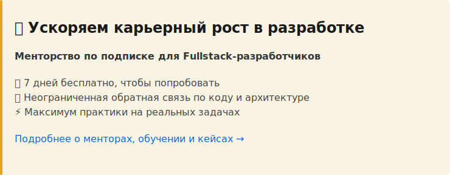

# 5.1.2 Модули и окружение

Node.js поддерживает две системы модулей: старую CommonJS и современную ESM. Чтобы запустить проект без проблем, нужно понимать разницу — и знать, как хранить секреты вне кода.

---

## 🎯 Что ты узнаешь

- Чем CommonJS отличается от ESM и когда применяется каждая система
- Как устроен `package.json` и зачем нужны `dependencies` vs `devDependencies`
- Как хранить секреты в `.env` и читать их через `dotenv`
- Как настроить TypeScript для Node.js через `tsconfig.json`

---

## 📖 CommonJS и ESM

Node.js изначально использовал CommonJS — систему модулей с `require` и `module.exports`. Позже появился ESM (ECMAScript Modules) — тот же синтаксис `import`/`export`, что и в браузере.

```typescript
// CommonJS — старый синтаксис
const fs = require("fs");
const { readFile } = require("fs/promises");
module.exports = { myFunction };

// ESM — современный синтаксис
import fs from "fs";
import { readFile } from "fs/promises";
export { myFunction };
```

По умолчанию Node.js воспринимает `.js`-файлы как CommonJS. Чтобы переключиться на ESM, нужно добавить `"type": "module"` в `package.json` или использовать расширение `.mjs`.

На практике это решает `tsx` — он поддерживает оба синтаксиса в `.ts`-файлах, так что можно писать `import`/`export` без дополнительных настроек.

Одна важная деталь: в CommonJS работают `__dirname` и `__filename`, а в ESM их нет — там используют `import.meta.url`:

```typescript
// ESM-эквивалент __dirname
import { fileURLToPath } from "url";
import path from "path";

const __filename = fileURLToPath(import.meta.url);
const __dirname = path.dirname(__filename);
```

---

## 📖 package.json

`package.json` — главный файл проекта. В нём описано всё: название, версия, скрипты для запуска, список зависимостей.

```json
{
  "name": "weather-api",
  "version": "1.0.0",
  "scripts": {
    "dev": "tsx watch src/index.ts",
    "build": "tsc",
    "start": "node dist/index.js",
    "test": "vitest"
  },
  "dependencies": {
    "express": "^4.18.2",
    "dotenv": "^16.3.1"
  },
  "devDependencies": {
    "tsx": "^4.6.0",
    "typescript": "^5.3.2",
    "@types/express": "^4.17.21",
    "@types/node": "^20.10.0"
  }
}
```

`dependencies` — пакеты, которые нужны приложению в продакшне: `express`, `dotenv`. `devDependencies` — только для разработки: `tsx`, `typescript`, типы (`@types/*`). При деплое `devDependencies` можно не устанавливать командой `npm install --production`.

Команды:

```bash
npm install express          # добавить в dependencies
npm install -D tsx           # добавить в devDependencies
npm install                  # установить все зависимости из package.json
npm run dev                  # запустить скрипт dev
```

---

## 📖 Переменные окружения и dotenv

Секреты — API-ключи, пароли, строки подключения к базе — нельзя хранить прямо в коде. Если закоммитить ключ в репозиторий, его увидят все. Вместо этого секреты кладут в файл `.env`:

```bash
# .env
WEATHER_API_KEY=abc123secret
PORT=3000
NODE_ENV=development
```

Файл `.env` добавляют в `.gitignore`, чтобы он не попал в репозиторий:

```bash
# .gitignore
.env
node_modules/
dist/
```

`dotenv` — пакет, который читает `.env` и загружает переменные в `process.env`. Вызывать его нужно один раз, в самом начале точки входа:

```typescript
// src/index.ts
import "dotenv/config"; // или: import dotenv from "dotenv"; dotenv.config();

import express from "express";

const PORT = process.env.PORT ?? "3000";
const apiKey = process.env.WEATHER_API_KEY;

if (!apiKey) {
  console.error("Ошибка: переменная WEATHER_API_KEY не задана");
  process.exit(1);
}

const app = express();
app.listen(Number(PORT), () => {
  console.log(`Сервер запущен на порту ${PORT}`);
});
```

Важно: `process.env` возвращает `string | undefined`. Проверяй наличие обязательных переменных при старте — лучше упасть с понятной ошибкой сразу, чем в середине работы.

---

## 📖 TypeScript для Node.js: tsconfig.json

TypeScript нужно объяснить, что код компилируется для Node.js, а не для браузера. Для этого настраивают `tsconfig.json`:

```json
{
  "compilerOptions": {
    "target": "ES2022",
    "module": "CommonJS",
    "moduleResolution": "node",
    "outDir": "./dist",
    "rootDir": "./src",
    "strict": true,
    "esModuleInterop": true,
    "skipLibCheck": true
  },
  "include": ["src/**/*"],
  "exclude": ["node_modules", "dist"]
}
```

Что здесь важно:
- `target: "ES2022"` — в какой стандарт JavaScript компилировать. Node.js 18+ поддерживает ES2022 полностью.
- `module: "CommonJS"` — формат модулей в скомпилированном коде.
- `outDir: "./dist"` — куда класть скомпилированные файлы.
- `strict: true` — включает все строгие проверки: `noImplicitAny`, `strictNullChecks` и другие.
- `esModuleInterop: true` — позволяет писать `import express from "express"` вместо `import * as express from "express"`.

Для разработки `tsc` не нужен — `tsx` запускает TypeScript напрямую. `tsc` используют для сборки продакшн-версии:

```bash
npm run build  # создаёт dist/
npm start      # запускает скомпилированный JS
```

---

## 📖 Структура проекта

Минимальная структура Node.js-проекта:

```
weather-api/
├── src/
│   └── index.ts        # точка входа
├── data/               # статические данные (JSON-файлы)
├── .env                # секреты (не в git)
├── .env.example        # шаблон переменных (в git)
├── .gitignore
├── package.json
└── tsconfig.json
```

`.env.example` — это файл-шаблон с названиями переменных без значений. Его коммитят в репозиторий, чтобы другие разработчики знали, какие переменные нужно задать:

```bash
# .env.example
WEATHER_API_KEY=
PORT=3000
NODE_ENV=development
```

---

## 🛠 Практика 5.1.2.1 — Настройка проекта

**Задача:** создать проект с нуля: `package.json`, `tsconfig.json`, установить зависимости, добавить `.env`.

**Шаги:**

```bash
mkdir weather-api && cd weather-api
npm init -y
npm install dotenv
npm install -D tsx typescript @types/node
mkdir src data
```

```json
// tsconfig.json — создай вручную
{
  "compilerOptions": {
    "target": "ES2022",
    "module": "CommonJS",
    "moduleResolution": "node",
    "outDir": "./dist",
    "rootDir": "./src",
    "strict": true,
    "esModuleInterop": true,
    "skipLibCheck": true
  },
  "include": ["src/**/*"],
  "exclude": ["node_modules", "dist"]
}
```

```typescript
// src/index.ts
// TODO: подключить dotenv через "dotenv/config"
// TODO: вывести process.env.PORT и process.env.NODE_ENV
// TODO: добавить проверку: если WEATHER_API_KEY не задан — выйти с ошибкой
```

```bash
# .env
PORT=3000
NODE_ENV=development
WEATHER_API_KEY=test_key_123
```

Добавь скрипт `"dev": "tsx src/index.ts"` в `package.json` и запусти `npm run dev`.

<details>
<summary>💡 Подсказка</summary>

```typescript
import "dotenv/config";

console.log("PORT:", process.env.PORT);
console.log("NODE_ENV:", process.env.NODE_ENV);

const apiKey = process.env.WEATHER_API_KEY;

if (!apiKey) {
  console.error("Ошибка: WEATHER_API_KEY не задан");
  process.exit(1);
}

console.log("Ключ загружен, длина:", apiKey.length);
```

</details>

---

## 🛠 Практика 5.1.2.2 — Модули: CommonJS vs ESM

**Задача:** написать два файла — утилиту и точку входа — и убедиться, что экспорт/импорт работает корректно.

```typescript
// src/utils/env.ts
// TODO: экспортировать функцию getRequiredEnv(key: string): string
// Если переменная не задана — бросить ошибку с текстом: `Переменная окружения ${key} не задана`
// Если задана — вернуть значение
```

```typescript
// src/index.ts
import "dotenv/config";
import { getRequiredEnv } from "./utils/env";

// TODO: получить WEATHER_API_KEY через getRequiredEnv
// TODO: вывести сообщение об успешном запуске
```

<details>
<summary>💡 Подсказка: env.ts</summary>

```typescript
export function getRequiredEnv(key: string): string {
  const value = process.env[key];
  if (!value) {
    throw new Error(`Переменная окружения ${key} не задана`);
  }
  return value;
}
```

</details>

<details>
<summary>💡 Подсказка: index.ts</summary>

```typescript
import "dotenv/config";
import { getRequiredEnv } from "./utils/env";

const apiKey = getRequiredEnv("WEATHER_API_KEY");
console.log("Приложение запущено, ключ загружен");
```

</details>

---

## 🎯 Финальное задание

Собери стартовый шаблон проекта `weather-api`, который станет основой для следующих разделов:

1. Структура файлов: `src/`, `data/`, `.env`, `.env.example`, `.gitignore`, `tsconfig.json`
2. `package.json` со скриптами: `dev`, `build`, `start`
3. `src/config.ts` — экспортирует объект с настройками приложения:

```typescript
// src/config.ts
export const config = {
  port: Number(process.env.PORT) || 3000,
  nodeEnv: process.env.NODE_ENV || "development",
  weatherApiKey: process.env.WEATHER_API_KEY || "",
};
```

4. `src/index.ts` — импортирует `config`, проверяет `weatherApiKey`, выводит `Сервер готов к запуску на порту ${config.port}`
5. `.env.example` с тремя переменными: `WEATHER_API_KEY`, `PORT`, `NODE_ENV`

Запусти `npm run dev` и убедись, что всё работает.

---

## ✅ Чеклист раздела

После изучения темы ты должен уметь:

- [ ] Объяснить разницу между CommonJS и ESM
- [ ] Различать `dependencies` и `devDependencies`
- [ ] Создавать `.env` файл и загружать его через `dotenv`
- [ ] Проверять наличие обязательных переменных при старте приложения
- [ ] Настраивать `tsconfig.json` для Node.js-проекта
- [ ] Создавать `src/config.ts` как единую точку конфигурации

---

## 🔗 Ресурсы

**Официальная документация:**
- [Node.js — Modules: CommonJS](https://nodejs.org/docs/latest/api/modules.html)
- [Node.js — ECMAScript Modules](https://nodejs.org/docs/latest/api/esm.html)
- [dotenv](https://github.com/motdotla/dotenv) — загрузка `.env`
- [TypeScript tsconfig reference](https://www.typescriptlang.org/tsconfig)

**Видео:**
- [Node.js #3 Модули (импорт и экспорт) — (Modules & Require - webDev)](https://www.youtube.com/watch?v=ufrqHbKmco8)

---

⏱ **Время на изучение**: 1-2 часа

---

**Следующая тема:** [5.2.1 Express + TypeScript: инициализация проекта](./5.2.1-Express-TypeScript.md)

---

[](https://xmentors.ru/dev?utm_source=baza_js)
